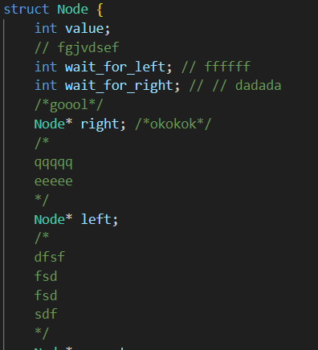
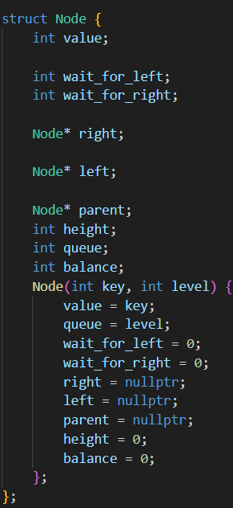

# Barmakova Ksenia M3102
Plagin makefilewithoutcomments
Этот плагин убирает комментарии из текущего файла, (только .h или .cpp). В этой же директории создает файл, добавляет к названию исходного copy. В котором находится исходный код со всеми комменатриями.
# Functionality
To use my plagin, we should press F5. Then choose file(.cpp or .h), that we would like to change. Press Ctrl+Shift+P and select Remove Comments.
# Example of usage 
## before using plagin 

## after using plagin 

# ShortCut
Ctrl+Shift+O